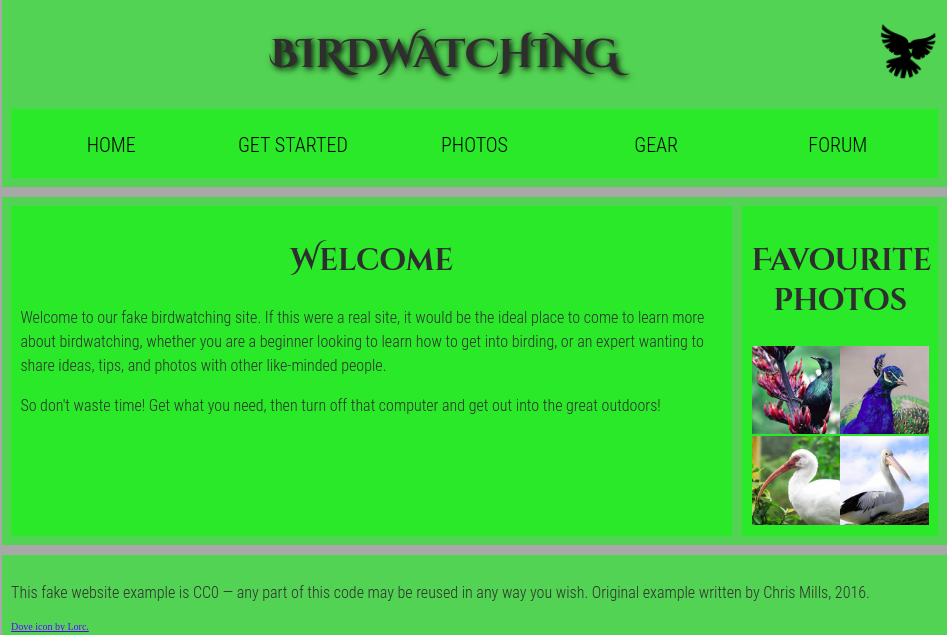

# Birdwatching project.

### this is the first project of [the Gomycode.tn](https://www.gomycode.tn) fullstack JS bootcamp.

## User Stories

1. <strong>User Story:</strong> The user can view a site's homepage and have a general idea about what the site is about.

2. <strong>User Story:</strong> The user can navigate from a page or an element to another through the the navigation bar.

    

# What did I learn:

1. How to create an HTML page.

2. How to organize a small website project's files and folders.

3. The basic HTML elements.

4. Converting a mockup to HTML and CSS.

5. How to style and modify the page with CSS.